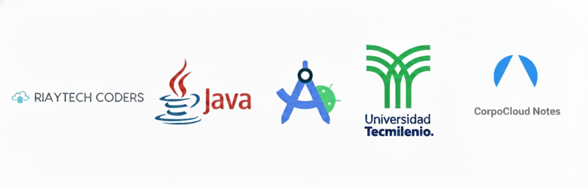

---

# Corpocloud
Aplicación Android para gestión de apuntes (CRUD) desarrollada en Java. Permite a los usuarios crear, editar, eliminar y visualizar notas, almacenándolas en una base de datos SQLite local.

🚀 Cómo Abrir en Android Studio
Se recomienda usar Android Studio Giraffe (o una versión superior) para asegurar la compatibilidad con los plugins de Gradle.

Clona este repositorio o descarga y extrae el archivo .zip en tu equipo.

Abre Android Studio y selecciona File -> Open...

Navega y selecciona la carpeta raíz del proyecto (la que contiene corpocloud_notes_project).

Espera a que Gradle sincronice todas las dependencias. Si el IDE te solicita actualizar el plugin de Gradle, sigue las indicaciones en pantalla.

Ejecuta la aplicación (puedes usar Shift+F10) en un emulador o en un dispositivo físico.

📦 Generar un APK (desde Android Studio)
En el menú superior, ve a Build -> Build Bundle(s) / APK(s).

Selecciona Build APK(s).

Una vez que la compilación termine, aparecerá una notificación. Haz clic en Locate para encontrar el archivo app-debug.apk.

💻 Compilar desde Terminal
Si prefieres compilar usando la línea de comandos:

Abre tu terminal (o CMD/PowerShell en Windows).

Navega hasta la carpeta raíz del proyecto (corpocloud_notes_project).

Ejecuta el wrapper de Gradle:

En Linux / Mac:

Bash

./gradlew assembleDebug
En Windows:

Bash

gradlew assembleDebug
El APK compilado se encontrará en la siguiente ruta: app/build/outputs/apk/debug/app-debug.apk

📋 Requisitos Previos
Asegúrate de tener el siguiente entorno configurado:

☕ JDK 11 (o superior).

🤖 Android Studio (Recomendado: Giraffe | 2022.3.1 o superior).
